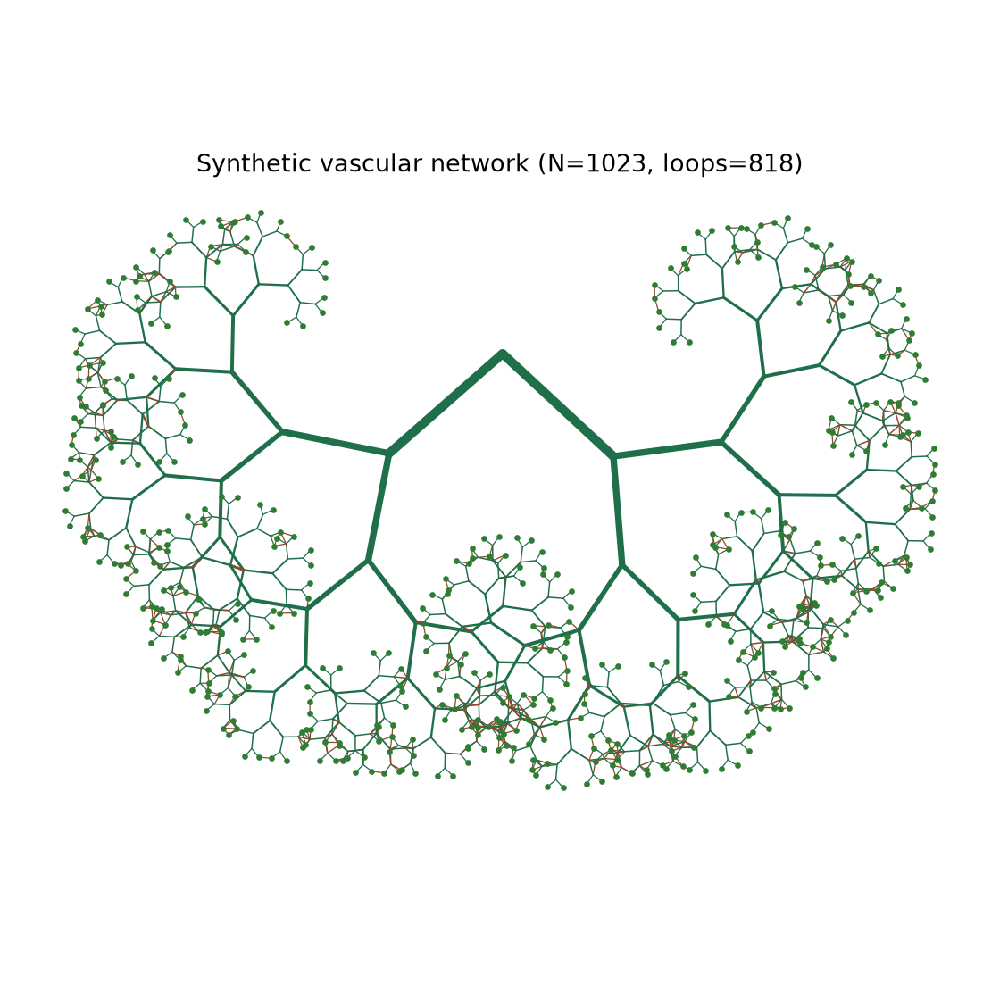
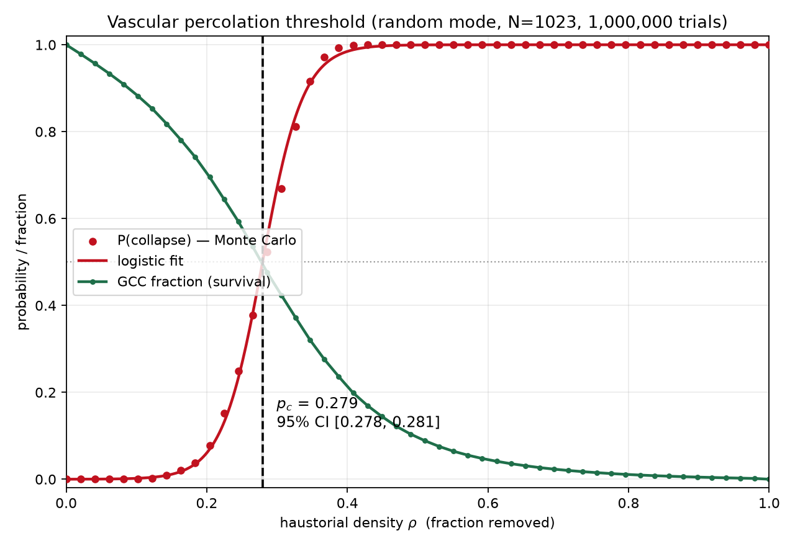
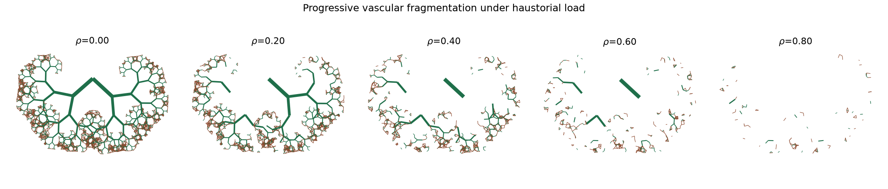
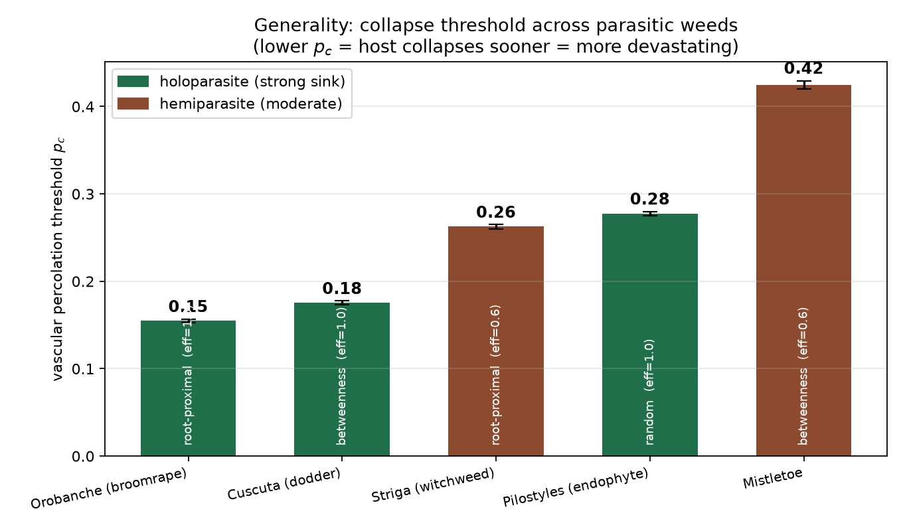

# Proposal Presentation — Slides + 5-Minute Script

**Format:** ≤ 5 minutes, all 4 members present. Fill in `[bracketed]` placeholders.
Slide content is written to be pasted directly into PowerPoint (keep bullets short
on the slide; the *spoken* detail lives in the script below).

---

# PART A — SLIDE CONTENT

---

## 🖼 FIGURE ASSET MAP  *(which PNG goes where)*

All figures are in `figures/`. They render on **white**, so they sit cleanly on a
light theme — **keep each figure's aspect ratio (don't stretch).**

| File | What it shows | Shape | Put it on |
|---|---|---|---|
| `network.png` | synthetic vascular network — *reads instantly as a plant* | square | **Slide 1** (title accent) |
| `sigmoid.png` | **HERO** — the p_c threshold, sharp collapse at ρ ≈ 0.28 | landscape 3:2 | **Slide 6B** (preliminary result) |
| `collapse_montage.png` | 5-panel "network shattering" story | ultra-wide banner | **Slide 6** (bottom strip) |
| `collapse.gif` | animated collapse (insert as video; plays in Slideshow) | square | Slide 6B (optional live demo) |
| `parasites.png` | 4-parasite p_c ranking + 95% CI error bars | wide 2:1 | **Slide 4B** |
| `pc_heatmap.png` | p_c surface over sink-strength K_h × D | landscape | Slide 6B / backup |
| `sigmoid_targeted.png` | backbone (betweenness) attack collapses sooner | landscape | Backup / Q&A |
| `stat_finite_size.png` | transition sharpens with size = real phase transition | landscape | Backup / Q&A |
| `stat_beta_fit.png` | critical exponent β power-law fit | landscape | Backup / Q&A |

**Previews of the four you'll use most:**

> *Tip: in PowerPoint, Insert → Pictures → This Device. For `collapse.gif`, insert
> it like a picture — it animates only in Slideshow mode. The montage is ~4.7:1, so
> use it as a full-width banner across the bottom of a slide.*

---

## SLIDE 1 — Title & Members  *(Section I: Name)*

**Haustorial Sink Strength and Pre-Symptomatic Vascular Collapse:
A Percolation Model of Holoparasite-Induced Hydraulic Failure in Host Plants**
*A Computational Biophysics Model Using Pre-Fractal Hydraulic Networks*

- **Researchers:** [Member A], [Member B], [Member C], [Member D]
- [School / Strand] · [Subject / PR2] · [Date]

> *Speaker note: 1 slide, just read the title and names.*
> 🖼 **FIGURE:** `network.png` as a **right-side panel or faded full-bleed
> background** (send it behind the text, ~25–40 % opacity). It reads instantly as
> "a plant," sets the theme, and makes the title slide pop without extra words.

---

## SLIDE 2 — Working Title & Big Question  *(Section II: Proposal)*

**Working title:** *Haustorial Sink Strength and Pre-Symptomatic Vascular
Collapse: A Percolation Model of Holoparasite-Induced Hydraulic Failure in Host
Plants.*

**One-line question:**
> *How much of a crop's internal "plumbing" can a parasite drain before the whole
> network suddenly collapses — and can we predict that point before the plant
> looks sick?*

- **Focus — holoparasites (full parasites):** ***Cuscuta*** (stem), ***Orobanche***
  (root), ***Pilostyles*** (systemic/endophytic) — three attachment types, one engine
- **Comparison only — hemiparasites:** *Striga* (root), mistletoe (stem)
- *Cuscuta* is the **calibration anchor** (best-documented strong sink)
- New metric proposed: **Vascular Percolation Threshold, p_c** — defined for *any*
  haustorial-sink attack

---

## SLIDE 3 — Why This Topic  *(Section III: Reasons / Justifications)*

- **A real agricultural threat.** Parasitic weeds (*Cuscuta*, and relatives
  *Striga* / *Orobanche*) cause major crop yield loss; *Striga* alone threatens
  ~50 million farmers in sub-Saharan Africa.
- **Detection happens too late.** Current methods (visual scouting, drones) spot
  *wilting* — which occurs **after** the damage is irreversible.
- **A gap no one has bridged.** Three research areas exist separately and have
  **never been combined**:
  1. Plant **hydraulic failure** 2. **Cuscuta** parasite biology 3. **Network
  theory** of how connected systems break.

> *Hook to memorize: "By the time you see it, it's already too late."*

---

## SLIDE 4 — Expected Contribution  *(Section IV: Growth of Knowledge)*

- **A new predictive metric — p_c**, the *mathematical tipping point* of vascular
  collapse. (First study to apply **percolation theory** to a parasite-stressed
  plant network.)
- **A pre-symptomatic early-warning window** — defines the danger line *before*
  visible symptoms.
- **A breeding insight** — denser vein networks (higher fractal dimension *D*)
  resist collapse longer → a target for resistant crops.
- **A general framework (already delivered — not future work).** The *same* engine
  models **three holoparasite types** (+ two hemiparasites for comparison) and ranks
  them by how fast they collapse the host
  (*Orobanche* → *Cuscuta* → *Striga* → *Pilostyles* → mistletoe); see Slide 4B.

---

## SLIDE 4B — Generality: Holoparasite Types (+ Hemiparasite Comparison)  *(supports Section IV)*

The same framework ranks three **holoparasite** attachment types, with two
**hemiparasites** as a comparison (lower p_c = collapses sooner = more devastating):

| Parasite | Type | Attacks | p_c (95% CI) |
|---|---|---|---|
| *Orobanche* (broomrape) | **holo** | root | **0.155** [0.153–0.157] |
| *Cuscuta* (dodder) | **holo** | stem | **0.175** [0.173–0.177] |
| *Striga* (witchweed) | hemi *(comp.)* | root | **0.263** [0.260–0.265] |
| *Pilostyles* (endophyte) | **holo** | systemic | **0.277** [0.275–0.280] |
| Mistletoe | hemi *(comp.)* | stem | **0.425** [0.420–0.430] |

- **Among holoparasites, *where* it attaches sets the threat:** root (*Orobanche*)
  > stem (*Cuscuta*) > systemic/diffuse (*Pilostyles*).
- **Same attachment, full beats partial:** holo collapses the host sooner than hemi
  (stem: *Cuscuta* 0.18 vs mistletoe 0.42; root: *Orobanche* 0.15 vs *Striga* 0.26).
- **The twist (a real finding):** a *targeted* hemiparasite (*Striga*, root) outranks
  a *diffuse* holoparasite (*Pilostyles*) — **where** you attack can beat **how completely**.
- **Statistically firm:** every adjacent pair has non-overlapping 95% bootstrap CIs.
  *(Still a model prediction awaiting wet-lab measurement.)*

> *Visual: the `parasites.png` bar chart with error bars. Answers "only Cuscuta?",
> "is the difference significant?", and shows attachment can outweigh trophic mode.*

---

## SLIDE 5 — Core Equations  *(optional: formulas needed)*

| Equation | Plain meaning |
|---|---|
| Murray's Law: **r_p³ = r₁³ + r₂³** | how vessels branch (sizes of pipes) |
| Hagen–Poiseuille: **R = 8ηL / πr⁴** | a pipe's resistance to flow |
| Hydraulic Ohm's Law: **Q = ΔΨ / R** | flow = pressure ÷ resistance |
| Haustorial sink: **Q = K_h (Ψ_host − Ψ_parasite)** | the parasite's "leak" *(our variable K_h)* |
| Percolation scaling: **P∞ ~ (p − p_c)^β** | how the network collapses near p_c |
| *(Future work)* Reaction–diffusion: **∂C/∂t = D∇²C + f(C) − σ** | resource depletion over time |

---

## SLIDE 6 — Methodology  *(1–6 sequence)*

1. **Generate** a synthetic reticulate vascular network (Murray's-law branching +
   loops, like real leaf veins).
2. **Measure** its fractal dimension **D** by box-counting.
3. **Solve** water flow with Kirchhoff's laws; attach the parasite as a
   haustorial **sink (K_h)**; let over-stressed vessels **embolize**.
4. **Monte Carlo:** remove vessels over many trials; track the **Giant Connected
   Component (GCC)** — collapse = GCC < 50%.
5. **Logistic regression** on the trials → pinpoint **p_c** (with a confidence
   interval).
6. **Sweep** K_h × D → build the **p_c surface** (heatmap of vulnerability).

> *Visual: small flow diagram, left→right arrows between the 6 boxes.*
> 🖼 **FIGURE:** drop `collapse_montage.png` as a **full-width banner across the
> bottom** — its five panels (ρ = 0 → 0.8) literally show the network shattering,
> which makes Step 4 (Monte Carlo removal) self-explanatory.

---

## SLIDE 6B — Preliminary Result: the threshold is real  *(supports Section IV)*

Our working model **already produces a sharp p_c** (from 1,000,000 Monte-Carlo
trials on an N = 1023 network):

- **p_c = 0.279** (95% CI [0.278, 0.281]) — the host loses *half* its connected
  vasculature after only ~**28 %** of vessels are drained.
- The collapse is **sudden, not gradual** — the hallmark of a true tipping point.

> 🖼 **FIGURE:** `sigmoid.png` as the **main, centered visual** — the red collapse
> curve crossing the green survival curve at the dashed p_c line is the single most
> persuasive image in the deck. *(Optional: `pc_heatmap.png` in a corner to preview
> the K_h × D sweep, or `collapse.gif` for a live animated collapse in Slideshow.)*
>
> *Proposal framing — say "preliminary": "This is early model output, shown to prove
> the method yields a clean threshold; full validation is our Chapter 4–5 work."*

---

## SLIDE 7 — Review of Related Literature  *(Section V: RRL — Chapter 2 preview)*

> *This is a condensed Chapter 2. On the board, show the five **theme headings**
> + the **synthesis/gap** box; the italic synthesis sentences are the spoken /
> paper-body detail. Each cluster is a* synthesis *of what the sources collectively
> establish — then what it contributes to our study — not a citation dump.*

**2.1 Parasitic plants as an agricultural threat.**
*Parasitic weeds are a major, worsening constraint on world agriculture. Witchweed
(*Striga*) alone affects ~50 million ha and >100 million people in sub-Saharan
Africa, costing ~US$1 billion/yr with 20–80 % yield losses; broomrape and dodder
add comparable burdens.* (Spallek et al., 2013; Runo & Kuria, 2018; Scholes &
Press, 2008; Parker, 2009.)
→ *Establishes significance: the host plants we model are economically real targets.*

**2.2 The haustorium as a hydraulic sink.**
*The study's parasites attach via a* haustorium *that bridges the host vasculature;
they differ on two axes — attachment site (stem / root / systemic) and trophic mode
(holo- vs hemiparasite). The three* holoparasites *span the attachment geometries:
*Cuscuta* (stem) forms an open xylem+phloem connection and acts as a "very strong
sink" (~86–99 % of captured assimilate, more water than it transpires); *Orobanche*
(root) is its root-attacking counterpart; *Pilostyles* (systemic/endophytic) taps
diffusely. *Striga* and mistletoe are the* hemiparasite *comparison — weaker,
mainly-xylem draws.* (Těšitel, 2016; Twyford, 2018; Nickrent, 2020; Yoshida et al.,
2016, 2019; Hibberd & Jeschke, 2001; Wolswinkel, 2006; Shilo et al., 2017; Spallek
et al., 2013; Glatzel & Geils, 2009.)
→ *Justifies modelling the parasite as a sink (K_h) and the holo>hemi "efficiency"
scale, across holoparasite types — not just dodder.*

**2.3 Hydraulic failure as a tipping point.**
*Plant water transport fails catastrophically, not gradually: it is increasingly
described with* catastrophe/bifurcation theory *as a tipping point, with angiosperms
suffering lethal failure near ~88 % loss of conductivity (P88).* (Tyree & Sperry,
1989; Sperry et al., 2003; Urli et al., 2013; "Catastrophic hydraulic failure &
tipping points," 2022.)
→ *Motivates a sharp* critical-threshold *metric — and frames percolation as a
complementary lens to catastrophe theory (a deliberate novelty, stated as such).*

**2.4 Network & percolation theory of collapse.**
*Network science predicts exactly when a connected system shatters: a giant component
survives only while connectivity stays above a critical removal fraction
f_c = 1 − 1/(κ − 1), and targeted attack on structurally important nodes collapses it
sooner than random failure.* (Albert & Barabási, 2002; Callaway et al., 2000;
Molloy–Reed criterion.)
→ *Supplies our core math (p_c) — and the backbone-vs-random attack contrast we use
for *Cuscuta* stem invasion.*

**2.5 Vascular architecture & fractal dimension.**
*Vein networks are quantifiable geometric objects: branching follows Murray's law,
networks scale allometrically, and real leaf venation has a measured box-counting
fractal dimension of ~1.39–1.76 — though recent work cautions that topological
metrics may describe venation better than a single D.* (Murray, 1926; McCulloh et
al., 2003; West et al., 1997; Crisci et al., *Relbunium*; Katifori et al., 2015;
Cheeseman et al., 2022.)
→ *Grounds the synthetic network's geometry and gives the empirical D-range we
recalibrated our model to match.*

---

## SLIDE 7B — Synthesis & Research Gap  *(closes Chapter 2)*

| Body of literature | Well-established | What it leaves open |
|---|---|---|
| Parasite biology (2.1–2.2) | parasites are strong vascular sinks | no *network-level* model of host collapse |
| Hydraulic failure (2.3) | failure is a sharp tipping point | framed as catastrophe theory, not percolation |
| Network/percolation (2.4) | when connected systems break (f_c) | never applied to a *parasite-stressed plant* |
| Vascular geometry (2.5) | venation is fractal & measurable | D rarely linked to *failure resistance* |

> **The gap (say aloud):** these four bodies of work are mature **but have never
> been combined.** No study treats a parasitized host as a *percolating network* and
> asks at what haustorial load it fragments. **That convergence — parasite sink +
> hydraulic failure + percolation + fractal geometry — is our contribution, and
> p_c is the bridge.**

---

## SLIDE 8 — Closing line *(optional)*

> **We turn an invisible, too-late diagnosis into a measurable, early-warning
> number — p_c.**  *Thank you.*

---

## SLIDE 9 — Backup / Q&A  *(do not present; pull up only if a judge asks)*

Hold these in reserve for rigor questions — they keep the main 5 minutes clean.

- **"Is it a *real* phase transition?"** → 🖼 `stat_finite_size.png` — the transition
  sharpens as the network grows (the signature of a genuine transition), and
  🖼 `stat_beta_fit.png` — the order parameter follows a power law (β = 0.745).
- **"What about a *targeted* attack?"** → 🖼 `sigmoid_targeted.png` — attacking the
  **backbone** (betweenness) collapses the host at p_c ≈ 0.18, far sooner than
  random (0.28) — matching *Cuscuta* stem invasion.
- **"Is the parasite ranking just noise?"** → point back to `parasites.png`: every
  adjacent pair has **non-overlapping 95% CIs** (statistically significant).

---
---

# PART B — 5-MINUTE SPOKEN SCRIPT (4 members)

*Total ≈ 5 min. Each member ≈ 70–75 seconds. Pattern: say the **technical term**,
then immediately **re-explain it simply**. Practice the transitions ("I'll now
hand over to…").*

---

### 🎤 MEMBER A — Title + the Problem  *(~70s, Slides 1–3)*

"Good [morning], everyone. We are [A], [B], [C], and [D], and our research is
titled *'Haustorial Sink Strength and Pre-Symptomatic Vascular Collapse: A
Percolation Model of Holoparasite-Induced Hydraulic Failure in Host Plants.'*

Let me unpack that. Our subject is **holoparasites** — "full" parasitic plants
that have completely given up making their own food and survive *entirely* by
stealing water and nutrients from crops. Our lead example is *Cuscuta campestris*,
dodder, but the *same* model also covers other holoparasites — *Orobanche*
(broomrape) and the endophytic *Pilostyles* — and we bring in the partial
**hemiparasites** (witchweed, mistletoe) as a comparison. They all attack the same
way: through **haustoria** — tiny biological **straws** that drill into the
plant's **vascular tissue**, its internal plumbing.

Here's the problem, and why we chose this topic: by the time a farmer *sees*
trouble — wilting, yellowing — the crop's internal water network has already
collapsed. The damage is done. Detection today is simply **too late**. I'll hand
over to [B] to explain what's missing in the science."

---

### 🎤 MEMBER B — The Gap + Our Contribution + the Physics  *(~75s, Slides 4–5)*

"Thanks, [A]. What's missing is that **three areas of science have never been
combined**: plant **hydraulic failure** — how a plant's water system breaks;
**parasite biology** — how these weeds feed; and **network theory** — the
mathematics of how any connected system, like a power grid or a road map, falls
apart.

Our contribution is to bridge all three with one number: the **Vascular
Percolation Threshold**, which we call **p_c**. In simple terms, **p_c is the
tipping point** — the exact fraction of the plant's water pipes that can be lost
before the entire network suddenly *shatters* into disconnected islands.

And we don't invent the physics — we use established laws: **Murray's law** for
how vessels branch, the **Hagen–Poiseuille equation** for flow resistance — which
is really just *thinner pipe, harder to push water through* — and **percolation
theory** for the collapse itself. The key claim: **p_c is crossed before the
plant looks sick.** [C] will now walk through how we actually compute it."

---

### 🎤 MEMBER C — Methodology  *(~75s, Slide 6)*

"Thank you, [B]. Our method has **six steps**.

**One**, we **generate a synthetic vascular network** — a computer model of the
plant's pipes — that branches realistically and includes **loops**, like the
veins in a real leaf. **Two**, we measure its **fractal dimension, D**, using
**box-counting** — basically a single number for *how densely the veins fill the
space*. **Three**, we **simulate the water flow** using **Kirchhoff's laws** —
the same circuit math used for electricity — and we add the parasite as a *leak*.

**Four**, the core step: a **Monte Carlo simulation** — we attack the network
*a million times*, removing pipes at random, and we watch the **Giant Connected
Component** — the largest surviving connected chunk. When it drops below half, the
plant has *collapsed*. **Five**, we use **logistic regression** — a standard
statistical method — to pinpoint **p_c** precisely. **Six**, we **sweep** the
parasite's strength against the network's shape to map how p_c changes. [D] will
close with why this matters."

---

### 🎤 MEMBER D — Significance + Literature + Close  *(~70s, Slides 4, 7–8)*

"Thanks, [C]. So what does this contribute? **Three things.** First, it
**reframes detection** — instead of waiting for wilting, we define the danger
line that comes *before* it. Second, our framework shows that **denser vein
networks resist collapse longer** — which gives plant breeders a concrete target
for tougher, more resistant crops. Third, it's **general across holoparasites** —
we ran the same model on several *full* parasites — dodder, broomrape, and an
endophytic one — and used the partial *hemiparasites*, witchweed and mistletoe, as
a comparison. It doesn't just work, it **ranks** them — and reveals something
subtle: ***where* a parasite attaches can matter more than how completely it
feeds**. A root parasite that targets the base can outrank a full parasite that
spreads diffusely. And that ranking is **statistically significant** — using
**bootstrap confidence intervals**, a method that asks *'could this ordering just
be random luck?'*, the answer is no: every neighbour is cleanly separated. So this
isn't a one-parasite trick — though we call it a *prediction* the model makes, one
a wet-lab can now go and test.

Our work stands on solid literature: **Sperry** on hydraulic failure, **Yoshida**
on *Cuscuta* and **Shilo** on broomrape biology, **Albert and Barabási** on network
attack, and **Crisci** on real leaf-vein fractal dimensions — which we use to
*validate* our model against actual plants.

To put our whole project in one sentence: **we turn an invisible, too-late
diagnosis into a measurable, early-warning number — p_c.** Thank you."

---

## ⏱ Timing & delivery tips
- 4 × ~72s = ~4:48 — leaves a small buffer. **Practice once with a timer.**
- Every technical term gets **one plain sentence** right after it — never leave a
  jargon word un-translated.
- Hand-offs ("I'll hand to [B]…") keep it smooth and show teamwork.
- Memorize the two anchor lines: *"By the time you see it, it's already too late"*
  and *"p_c is crossed before the plant looks sick."*
- If you have **30 extra seconds**, [B] or [C] can mention: *"Our preliminary
  model already produces a sharp threshold at about 28% vessel loss, and we
  validated its fractal dimension against real leaf measurements."*
